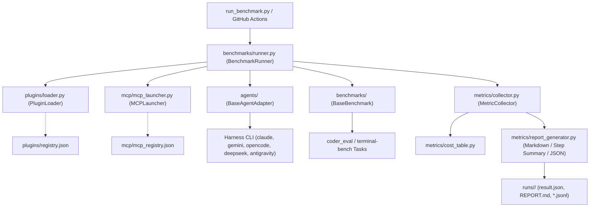

# AI Harness & Plugin Benchmark Suite

[](https://github.com/Heretek-AI/harness-benchmark/actions/workflows/benchmark.yml)
[](https://www.python.org/downloads/)
[](https://github.com/astral-sh/ruff)
[](https://opensource.org/licenses/MIT)
[](https://modelcontextprotocol.io/)

A production-ready, matrix-based automated benchmark suite for evaluating **AI Coding Harnesses** (`claude-code`, `antigravity-cli`, `gemini-cli`, `opencode`, `deepseek-harness`, `DeepSeek-Reasonix`), **Model Context Protocol (MCP) Servers** (`chrome-devtools-mcp`, `codebase-memory-mcp`, `context7`, `repomix`), and **Agent Plugins** (`caveman`, `claude-mem`, `ECC`, `graphify`, `headroom`, `ponytail`, `rtk`, `Understand-Anything`) across standardized benchmarks ([`coder_eval`](https://github.com/UiPath/coder_eval), `terminal-bench`) under controlled LLM configurations (`LLM_API`, `LLM_KEY`, `LLM_MODEL`).

---

## 🚀 Key Features

* **Universal Harness Adapters**: Standardized lifecycle interface (`setup`, `execute_task`, `teardown`) isolating harness CLI mechanics.
* **Dynamic Plugin & MCP Injection**: Zero-code catalog synthesis allowing arbitrary combinations of plugins and stdio/SSE MCP servers to be loaded into any agent.
* **Multi-Suite Benchmark Orchestration**: Unified execution of coding problem manifests (`coder_eval`) and interactive shell tasks (`terminal-bench`) with synthetic smoke fallbacks.
* **Granular Metrics & Cost Accounting**: Tracks Pass@1 accuracy, p50/p95 latency, input/output tokens, tool call frequency, and USD cost per run.
* **Matrixed GitHub Actions Automation**: Dynamic matrix setup job fanning out runs across parallel GitHub Actions runners with automated `$GITHUB_STEP_SUMMARY` reporting.
* **Rich Output Formats**: Emits structured `result.json`, GitHub-flavored Markdown `REPORT.md`, and per-task streaming `.jsonl` trace files.

---

## 📐 Architecture Overview



---

## 📁 Repository Layout

```text
├── .github/
│   └── workflows/
│       ├── benchmark.yml             # Matrixed dispatch workflow with dynamic matrix generation
│       └── benchmark-report.yml      # Aggregates run artifacts and publishes PR comments
├── agents/                           # Wrapper adapters for each agent CLI
│   ├── __init__.py                   # Adapter registry mapping harness name -> class
│   ├── base.py                       # Abstract Base Agent interface & ExecutionResult model
│   ├── antigravity_adapter.py        # Google Antigravity CLI adapter
│   ├── claude_code_adapter.py        # Anthropic Claude Code adapter with JSONL parsing
│   ├── deepseek_harness_adapter.py   # DeepSeek & DeepSeek-Reasonix LiteLLM adapter
│   ├── gemini_cli_adapter.py         # Google Gemini CLI adapter with extension synthesis
│   ├── opencode_adapter.py           # OpenCode adapter with provider config synthesis
│   └── stub_adapter.py               # Hermetic mock adapter for smoke tests
├── plugins/                          # Dynamic plugin injection layer & manifests
│   ├── registry.json                 # Catalog of supported plugins and injection points
│   ├── registry.schema.json          # JSON Schema for plugin registry
│   └── loader.py                     # Dynamically stages plugins into agent configs
├── mcp/                              # MCP server configs & launch wrappers
│   ├── mcp_registry.json             # Catalog of MCP servers (stdio & SSE)
│   ├── mcp_registry.schema.json      # JSON Schema for MCP registry
│   └── mcp_launcher.py               # Spawns and manages MCP server subprocesses
├── benchmarks/                       # Benchmark runners and graders
│   ├── base.py                       # BaseBenchmark and JSONManifestBenchmark abstractions
│   ├── coder_eval_adapter.py         # UiPath coder_eval dataset adapter
│   ├── terminal_bench_adapter.py     # Terminal/CLI task execution adapter
│   └── runner.py                     # Unified benchmark execution orchestrator
├── configs/
│   ├── presets/                      # Pre-baked benchmark suites
│   │   ├── full_matrix.yaml          # Nightly multi-agent sweep
│   │   ├── smoke_test.yaml           # Fast PR-time sanity check
│   │   └── mcp_isolation.yaml        # Isolated MCP performance regression tests
│   └── schema.json                   # JSON schema for run configurations
├── metrics/                          # Evaluation and reporting
│   ├── collector.py                  # Accumulates Pass@1, latency, tokens, tool usage
│   ├── cost_table.py                 # USD token pricing table per model
│   └── report_generator.py           # Markdown table & GitHub Step Summary generator
├── tests/                            # Comprehensive Pytest test suite
├── run_benchmark.py                  # Main CLI entrypoint
├── requirements.txt                  # Python dependencies
├── pyproject.toml                    # Package metadata & build configuration
├── AGENTS.md                         # Universal AI agent operating guidelines
├── CLAUDE.md                         # Claude Code CLI developer guide
├── GEMINI.md                         # Gemini CLI & Antigravity developer guide
└── README.md                         # Project documentation
```

---

## ⚡ Quickstart (Local CLI)

### 1. Installation

```bash
git clone https://github.com/Heretek-AI/harness-benchmark.git
cd harness-benchmark
pip install -r requirements.txt
```

### 2. Run Smoke Tests (No API Keys Required)

Use the built-in hermetic `stub` harness to verify the full orchestration pipeline without incurring API costs:

```bash
# Run the pre-configured smoke test preset
python run_benchmark.py --config configs/presets/smoke_test.yaml --harness stub --output-format markdown
```

### 3. Run Live Evaluation Sweeps

Set your LLM credentials and run target combinations:

```bash
export LLM_API="https://api.openai.com/v1"
export LLM_KEY="sk-..."
export LLM_MODEL="gpt-4o"

# Run Claude Code against coder_eval with specific MCP servers:
python run_benchmark.py \
  --harness claude-code \
  --benchmark coder_eval \
  --plugins none \
  --mcp chrome-devtools-mcp,codebase-memory-mcp,context7,repomix \
  --tasks-limit 3 \
  --output-format github-summary
```

---

## 🛠️ CLI Reference

```text
usage: harness-benchmark [-h] [--config CONFIG] [--harness HARNESS] [--benchmark BENCHMARK]
                         [--plugins PLUGINS] [--mcp MCP_SERVERS] [--tasks-limit TASKS_LIMIT]
                         [--timeout TIMEOUT] [--output-format {json,markdown,github-summary}]
                         [--output-dir OUTPUT_DIR] [--name NAME]
                         [--plugin-registry PLUGIN_REGISTRY] [--mcp-registry MCP_REGISTRY] [-v]
```

| Flag | Description | Default |
|---|---|---|
| `--config` | Path to preset YAML (`configs/presets/*.yaml`) | `None` |
| `--harness` | Comma-separated harness names or `all` | `all` |
| `--benchmark` | Comma-separated benchmarks (`coder_eval`, `terminal-bench`) or `all` | `all` |
| `--plugins` | Comma-separated plugin names, `all`, or `none` | `none` |
| `--mcp` | Comma-separated MCP server names, `all`, or `none` | `none` |
| `--tasks-limit` | Integer cap on tasks per cell (0 = unlimited) | `0` |
| `--timeout` | Timeout in seconds per task execution | `600` |
| `--output-format` | Output format: `json`, `markdown`, `github-summary` | `json` |
| `--output-dir` | Directory where run artifacts are written | `runs` |
| `--name` | Custom name prefix for the run ID | `ad-hoc` |

---

## 📊 Evaluation Outputs & Artifacts

Each benchmark invocation creates a durable run directory `./runs/<run-id>/` containing:

1. **`result.json`**: Structured JSON report with cell-level summaries and task results.
2. **`REPORT.md`**: Formatted Markdown comparison table with tool call breakdown.
3. **`<harness>__<benchmark>__<task_id>.jsonl`**: Individual task execution traces.

### Sample Summary Table Output

| Harness | Benchmark | Plugins | MCP | Pass@1 | Latency p50 | Latency p95 | Tokens (in/out) | Cost | Tasks |
|---|---|---|---|---:|---:|---:|---:|---:|---:|
| `claude-code` | `coder_eval` | `none` | `context7` | **92.5%** | 4,210 ms | 7,850 ms | 12,450/3,120 | $0.0841 | 25 |
| `antigravity-cli` | `coder_eval` | `caveman` | `codebase-memory-mcp` | **88.0%** | 3,890 ms | 6,940 ms | 10,800/2,890 | $0.0652 | 25 |
| `deepseek-harness` | `terminal-bench` | `none` | `repomix` | **84.0%** | 2,150 ms | 4,320 ms | 8,400/1,950 | $0.0154 | 25 |

---

## 🤖 GitHub Actions CI/CD

The workflow at [`.github/workflows/benchmark.yml`](.github/workflows/benchmark.yml) supports matrixed testing:

1. **Granular Dispatch**: Trigger ad-hoc sweeps from GitHub Actions UI with custom harness, benchmark, plugin, and MCP selections.
2. **Dynamic Matrix Expansion**: `setup-matrix` computes test cells from the repository catalogs.
3. **Parallel Matrix Execution**: Runs each combination concurrently across Ubuntu runners.
4. **Step Summary Reporting**: Aggregates all JSON artifacts into a unified comparison table posted to GitHub Step Summary.

### Required Repository Secrets

* `LLM_API`: API Endpoint URL (e.g. `https://api.openai.com/v1` or LiteLLM proxy).
* `LLM_KEY`: API authentication key.
* `LLM_MODEL`: Target model identifier used across all harnesses for controlled comparison.

---

## 🧩 Extending the Benchmark Suite

### Adding a New Harness
1. Subclass `BaseAgentAdapter` in `agents/<name>_adapter.py`.
2. Implement `_on_setup`, `_build_command`, and `resolve_cli`.
3. Register the class in `agents/__init__.py` (`ADAPTERS["<name>"] = ...`).

### Adding a New MCP Server
Append an entry to `mcp/mcp_registry.json`:
```json
{
  "servers": {
    "my-mcp": {
      "display_name": "My MCP Server",
      "command": "npx",
      "args": ["-y", "my-mcp@latest"],
      "env": {},
      "transport": "stdio"
    }
  }
}
```

### Adding a New Plugin
Append an entry to `plugins/registry.json`:
```json
{
  "plugins": {
    "my-plugin": {
      "display_name": "My Plugin",
      "source_path": "plugins/my-plugin",
      "format": "claude-plugin",
      "injects": ["commands", "hooks"]
    }
  }
}
```

---

## 🧪 Testing

Run the full automated test suite:

```bash
pytest -v
```

---

## 📄 License

This repository is licensed under the [MIT License](LICENSE).

---

## 🔍 SEO & Discovery Keywords

`ai-agents` · `coding-agents` · `benchmark` · `mcp` · `model-context-protocol` · `claude-code` · `antigravity` · `gemini-cli` · `deepseek` · `opencode` · `llm-eval` · `litellm` · `coder-eval` · `terminal-bench` · `agentic-workflows`