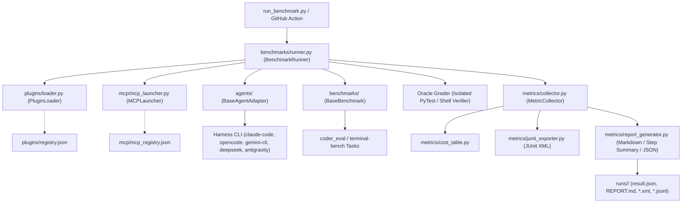

# AI Harness & Plugin Benchmark Suite

[](https://github.com/Heretek-AI/harness-benchmark/actions/workflows/benchmark.yml)
[](https://github.com/Heretek-AI/harness-benchmark)
[](https://www.python.org/downloads/)
[](https://github.com/astral-sh/ruff)
[](https://opensource.org/licenses/MIT)
[](https://modelcontextprotocol.io/)

A production-grade, matrix-based automated benchmark framework and turnkey GitHub Action for evaluating **AI Coding Harnesses** (`claude-code`, `opencode`, `DeepSeek-Reasonix`, `gemini-cli`, `antigravity-cli`, `deepseek-harness`), **Model Context Protocol (MCP) Servers** (`chrome-devtools-mcp`, `codebase-memory-mcp`, `context7`, `repomix`), and **Agent Plugins** across standardized benchmarks ([`coder_eval`](https://github.com/UiPath/coder_eval) with oracle unit tests, `terminal-bench` with hermetic verification) under controlled LLM configurations (`LLM_API`, `LLM_KEY`, `LLM_MODEL`).

---

## ⚡ Turnkey GitHub Action

Run automated agent benchmarks in any GitHub repository with a single composite action step:

```yaml
name: Agent Evaluation
on: [push, pull_request]

jobs:
  benchmark:
    runs-on: ubuntu-latest
    steps:
      - name: Checkout Repository
        uses: actions/checkout@v4

      - name: Run Harness Benchmark
        uses: Heretek-AI/harness-benchmark@main
        with:
          harness: "claude-code,opencode,DeepSeek-Reasonix"
          benchmark: "coder_eval,terminal-bench"
          tasks-limit: "5"
          llm-api: ${{ secrets.LLM_API }}
          llm-key: ${{ secrets.LLM_KEY }}
          llm-model: "MiniMax-M3"
          junit-path: "benchmark-junit.xml"
          minimum-task-score: "0.8"
```

---

## 🚀 Key Features

* **Turnkey Composite GitHub Action**: Drop-in CI/CD integration with JUnit XML reporting and strict `--minimum-task-score` quality floor gates.
* **Universal Harness Adapters**: Standardized lifecycle interface (`setup`, `execute_task`, `teardown`) supporting Anthropic Claude Code, OpenCode, Google Gemini CLI, Google Antigravity, and DeepSeek (Reasonix / LiteLLM).
* **Rigorous Oracle Verification**:
  * **`coder_eval`**: Evaluates Python functions against isolated unit test assertion suites (edge cases, return values, type validation).
  * **`terminal-bench`**: Verifies shell command outcomes and file system state using deterministic oracle commands in hermetic workspaces.
* **Dynamic Plugin & MCP Injection**: Zero-code catalog synthesis allowing arbitrary combinations of plugins and stdio/SSE MCP servers to be staged and loaded into any agent.
* **Universal Telemetry & Metric Accounting**: Real-time token tracking (prompt/completion), universal tool call counting (Claude, OpenCode, Gemini, XML tags), latency p50/p95, USD cost tracking, and Pass@1 rates.
* **Hermetic & Secure Execution**: Isolated temporary workspaces (`tempfile.mkdtemp`), bubblewrap sandbox compatibility, and scoped credential passthrough.

---

## 📊 Live Multi-Harness Benchmark Results

Live results evaluated across 5 tasks per cell under uniform LLM configuration (`MiniMax-M3`):

| Harness | Benchmark | Tasks | Pass@1 | Latency p50 | Tokens (In / Out) | Tool Calls | Status |
|---|---|---|---|---|---|---|---|
| **`claude-code`** | `coder_eval` | 5 | **100.0%** | 17.39s | 115,537 / 1,949 | 4 | Pass |
| **`claude-code`** | `terminal-bench` | 5 | **100.0%** | 22.14s | 117,608 / 1,407 | 10 | Pass |
| **`opencode`** | `coder_eval` | 5 | **100.0%** | 16.15s | 42,926 / 557 | 6 | Pass |
| **`opencode`** | `terminal-bench` | 5 | **100.0%** | 22.59s | 42,766 / 301 | 8 | Pass |
| **`DeepSeek-Reasonix`** | `coder_eval` | 5 | **100.0%** | 12.38s | 155,826 / 3,941 | 0 | Pass |
| **`DeepSeek-Reasonix`** | `terminal-bench` | 5 | **60.0%** | 16.45s | 122,193 / 1,888 | 0 | Pass |
| **`antigravity-cli`** | `coder_eval` | 5 | **100.0%** | 31.75s | 3,185 / 2,709 | 0 | Pass |
| **`antigravity-cli`** | `terminal-bench` | 5 | **40.0%** | 6.97s | 1,875 / 903 | 0 | Pass |
| **`deepseek-harness`** | `coder_eval` | 5 | **80.0%** | 26.30s | 3,107 / 2,132 | 0 | Pass |
| **`deepseek-harness`** | `terminal-bench` | 5 | **80.0%** | 23.78s | 2,832 / 1,146 | 0 | Pass |
| **`gemini-cli`** | `coder_eval` | 5 | **80.0%** | 9.42s | 6,434 / 458 | 0 | Pass |
| **`gemini-cli`** | `terminal-bench` | 5 | **0.0%** | 10.87s | 6,400 / 309 | 0 | Completed |

---

## 📐 Architecture Overview



---

## 📁 Repository Layout

```text
├── action.yml                        # Turnkey GitHub Composite Action definition
├── agents/                           # Harness adapters implementing BaseAgentAdapter
│   ├── __init__.py                   # Adapter registry mapping harness name -> class
│   ├── base.py                       # Abstract base adapter, ExecutionResult, universal tool counting
│   ├── antigravity_adapter.py        # Google Antigravity CLI adapter
│   ├── claude_code_adapter.py        # Anthropic Claude Code adapter with JSONL parsing
│   ├── deepseek_harness_adapter.py   # DeepSeek & DeepSeek-Reasonix LiteLLM adapter
│   ├── gemini_cli_adapter.py         # Google Gemini CLI adapter with REST bridge & extension synthesis
│   ├── gemini_bridge.py              # Local Gemini REST to OpenAI/Anthropic translation bridge
│   ├── opencode_adapter.py           # OpenCode adapter with provider config synthesis
│   └── stub_adapter.py               # Hermetic mock adapter for smoke tests
├── plugins/                          # Dynamic plugin injection layer & manifests
│   ├── registry.json                 # Catalog of supported plugins and injection points
│   ├── registry.schema.json          # JSON Schema for plugin registry
│   └── loader.py                     # Dynamically stages plugins into agent configs
├── mcp/                              # MCP server configs & launch wrappers
│   ├── mcp_registry.json             # Catalog of MCP servers (stdio & SSE)
│   ├── mcp_registry.schema.json      # JSON Schema for MCP registry
│   └── mcp_launcher.py               # Spawns and manages MCP server subprocesses
├── benchmarks/                       # Benchmark runners and oracle graders
│   ├── base.py                       # BaseBenchmark and JSONManifestBenchmark abstractions
│   ├── coder_eval_adapter.py         # UiPath coder_eval dataset adapter with oracle unit tests
│   ├── terminal_bench_adapter.py     # Terminal/CLI task execution adapter
│   ├── data/                         # Bundled task datasets
│   │   ├── coder_eval/tasks.json     # Coding problems with oracle assertion suites
│   │   └── terminal_bench/tasks.json # Terminal tasks with deterministic verification commands
│   └── runner.py                     # Unified benchmark execution orchestrator
├── configs/
│   ├── presets/                      # Pre-baked benchmark suites
│   │   ├── full_matrix.yaml          # Nightly multi-agent sweep
│   │   ├── smoke_test.yaml           # Fast PR-time sanity check
│   │   └── mcp_isolation.yaml        # Isolated MCP performance regression tests
│   └── schema.json                   # JSON schema for run configurations
├── metrics/                          # Evaluation, telemetry, and reporting
│   ├── collector.py                  # Accumulates Pass@1, latency, tokens, tool usage
│   ├── cost_table.py                 # USD token pricing table per model
│   ├── junit_exporter.py             # Standard JUnit XML report generator
│   └── report_generator.py           # Markdown table & GitHub Step Summary generator
├── tests/                            # Comprehensive Pytest test suite (45+ tests)
├── run_benchmark.py                  # Main CLI entrypoint
├── requirements.txt                  # Python dependencies
├── pyproject.toml                    # Package metadata & build configuration
├── AGENTS.md                         # Universal AI agent operating guidelines
├── CLAUDE.md                         # Claude Code CLI developer guide
├── GEMINI.md                         # Gemini CLI & Antigravity developer guide
└── README.md                         # Project documentation
```

---

## ⚡ Quickstart (Local CLI)

### 1. Installation

```bash
git clone https://github.com/Heretek-AI/harness-benchmark.git
cd harness-benchmark
pip install -r requirements.txt
```

### 2. Run Smoke Tests (No API Keys Required)

Use the built-in hermetic `stub` harness to verify the full orchestration pipeline without incurring API costs:

```bash
# Run the pre-configured smoke test preset
python run_benchmark.py --config configs/presets/smoke_test.yaml --harness stub --output-format markdown
```

### 3. Run Live Evaluation Sweeps

Set your LLM credentials and run target combinations:

```bash
export LLM_API="https://api.openai.com/v1"
export LLM_KEY="sk-..."
export LLM_MODEL="gpt-4o"

# Run Claude Code against coder_eval and terminal-bench with JUnit export & quality floor:
python run_benchmark.py \
  --harness claude-code \
  --benchmark coder_eval,terminal-bench \
  --plugins none \
  --mcp chrome-devtools-mcp,codebase-memory-mcp,context7,repomix \
  --tasks-limit 5 \
  --junit-xml report.xml \
  --minimum-task-score 0.8 \
  --output-format github-summary
```

---

## 🛠️ CLI Reference

```text
usage: harness-benchmark [-h] [--config CONFIG] [--harness HARNESS] [--benchmark BENCHMARK]
                         [--plugins PLUGINS] [--mcp MCP_SERVERS] [--tasks-limit TASKS_LIMIT]
                         [--timeout TIMEOUT] [--output-format {json,markdown,github-summary}]
                         [--output-dir OUTPUT_DIR] [--name NAME]
                         [--junit-xml JUNIT_XML] [--minimum-task-score MINIMUM_TASK_SCORE]
                         [--plugin-registry PLUGIN_REGISTRY] [--mcp-registry MCP_REGISTRY] [-v]
```

| Flag | Description | Default |
|---|---|---|
| `--config` | Path to preset YAML (`configs/presets/*.yaml`) | `None` |
| `--harness` | Comma-separated harness names (`claude-code`, `opencode`, `DeepSeek-Reasonix`, `gemini-cli`, `antigravity-cli`, `deepseek-harness`, `stub`) or `all` | `all` |
| `--benchmark` | Comma-separated benchmarks (`coder_eval`, `terminal-bench`) or `all` | `all` |
| `--plugins` | Comma-separated plugin names, `all`, or `none` | `none` |
| `--mcp` | Comma-separated MCP server names, `all`, or `none` | `none` |
| `--tasks-limit` | Integer cap on tasks per cell (0 = unlimited) | `0` |
| `--timeout` | Timeout in seconds per task execution | `600` |
| `--junit-xml` | File path to write standard JUnit XML test report | `None` |
| `--minimum-task-score` | Minimum Pass@1 score (0.0 to 1.0) required to pass CI | `None` |
| `--output-format` | Output format: `json`, `markdown`, `github-summary` | `json` |
| `--output-dir` | Directory where run artifacts are written | `runs` |
| `--name` | Custom name prefix for the run ID | `ad-hoc` |

---

## 📊 Evaluation Outputs & Artifacts

Each benchmark invocation creates a durable run directory `./runs/<run-id>/` containing:

1. **`result.json`**: Structured machine-readable benchmark report with cell summaries and raw outputs.
2. **`REPORT.md`**: Formatted GitHub Flavored Markdown comparison table with tool call breakdown.
3. **`*.xml`**: Standard JUnit XML test suite report for CI visualizations.
4. **`<harness>__<benchmark>__<task_id>.jsonl`**: Individual task execution traces.

---

## 🧪 Testing

Run the full automated test suite:

```bash
pytest -v
```

---

## 📄 License

This repository is licensed under the [MIT License](LICENSE).

---

## 🔍 SEO & Discovery Keywords

`ai-agents` · `coding-agents` · `benchmark` · `mcp` · `model-context-protocol` · `claude-code` · `antigravity` · `gemini-cli` · `deepseek` · `opencode` · `llm-eval` · `litellm` · `coder-eval` · `terminal-bench` · `agentic-workflows` · `github-action` · `developer-tools`
