# AI Coding Harness, MCP & LSP Benchmark Suite

[](https://github.com/Heretek-AI/harness-benchmark/actions/workflows/benchmark.yml)
[](https://github.com/Heretek-AI/harness-benchmark)
[](https://www.python.org/downloads/)
[](https://github.com/astral-sh/ruff)
[](https://opensource.org/licenses/MIT)
[](https://modelcontextprotocol.io/)

A production-grade, matrix-based automated benchmark framework and turnkey GitHub Action for evaluating **AI Coding Harnesses** (`claude-code`, `opencode`, `DeepSeek-Reasonix`, `gemini-cli`, `antigravity-cli`, `deepseek-harness`, in-process `agent-engine`), **Model Context Protocol (MCP) Servers** (`chrome-devtools-mcp`, `codebase-memory-mcp`, `context7`, `repomix`), **Language Server Protocol (LSP) Diagnostics**, and **Agent Plugins** across standardized benchmarks ([`coder_eval`](https://github.com/UiPath/coder_eval) with isolated unit tests, `terminal-bench` with deterministic shell verifications) under controlled LLM configurations (`LLM_API`, `LLM_KEY`, `LLM_MODEL`).

---

## ⚙️ Prerequisites

The `plugins/registry.json` and `mcp/mcp_registry.json` catalogs reference source paths under a `review/` workspace (gitignored). Clone the upstream repos into `review/` before running non-trivial matrix sweeps so the plugin loader and MCP launcher can stage real source material:

```bash
mkdir -p review/claude-plugins review/mcp
# Example: clone the upstream Claude plugins referenced by plugins/registry.json
git clone https://github.com/<upstream>/caveman        review/claude-plugins/caveman
git clone https://github.com/<upstream>/claude-mem     review/claude-plugins/claude-mem
git clone https://github.com/<upstream>/ECC           review/claude-plugins/ECC
git clone https://github.com/<upstream>/graphify       review/claude-plugins/graphify
git clone https://github.com/<upstream>/headroom       review/claude-plugins/headroom
git clone https://github.com/<upstream>/ponytail       review/claude-plugins/ponytail
git clone https://github.com/<upstream>/rtk            review/claude-plugins/rtk
git clone https://github.com/<upstream>/Understand-Anything review/claude-plugins/Understand-Anything

# MCP servers are launched via npx/uvx at runtime; no clone is required for those,
# but their `source_path` entries are only used for diff/review purposes.
```

The smoke preset (`--preset smoke_test`) and the `stub` / `agent-engine` harnesses do **not** require the `review/` workspace.

---

## ⚡ Turnkey GitHub Action

Run automated agent benchmarks in any GitHub repository with a single composite action step:

```yaml
name: Agent Evaluation & Ablation
on: [push, pull_request]

jobs:
  benchmark:
    runs-on: ubuntu-latest
    steps:
      - name: Checkout Repository
        uses: actions/checkout@v4

      - name: Run Harness Benchmark
        uses: Heretek-AI/harness-benchmark@main
        with:
          harness: "claude-code,opencode,DeepSeek-Reasonix"
          benchmark: "coder_eval,terminal-bench"
          tasks-limit: "5"
          llm-api: ${{ secrets.LLM_API }}
          llm-key: ${{ secrets.LLM_KEY }}
          llm-model: "MiniMax-M3"
          ab-test: "true"
          publish-issue: "true"
          junit-path: "benchmark-junit.xml"
          minimum-task-score: "0.8"
```

---

## 🚀 Key Features

* **5-Tier Multi-Ablation Engine**: Empirically proves the statistical performance delta across 5 deterministic tiers:
  1. `tier_0_bare`: Raw model prompt reasoning.
  2. `tier_1_lsp`: + Language Server Protocol (LSP) AST compiler diagnostics feedback loop.
  3. `tier_2_skills`: + Skills, prompt engineering modules, and rule harnesses.
  4. `tier_3_mcp`: + Model Context Protocol (MCP) dynamic tool servers (stdio / SSE).
  5. `tier_4_full_stack`: Full Stack Augmentation (LSP + Skills + MCP).
* **Turnkey Composite GitHub Action**: Drop-in CI/CD integration with JUnit XML reporting, date-labeled GitHub issue publishing, and strict `--minimum-task-score` quality floor gates.
* **Universal Harness Adapters**: Standardized lifecycle interface (`setup`, `execute_task`, `teardown`) supporting Anthropic Claude Code, OpenCode, Google Gemini CLI, Google Antigravity, and DeepSeek (Reasonix / LiteLLM).
* **Rigorous Oracle Verification**:
  * **`coder_eval`**: Evaluates Python functions against isolated unit test assertion suites in sandboxed subprocesses.
  * **`terminal-bench`**: Verifies shell command outcomes and file system state using deterministic oracle commands in hermetic workspaces.
* **Human-Centric Model Scorecard & Leaderboard**: Rich colored console leaderboards, per-task drilldown tables, failure classification analysis, and ASCII interaction swimlane diagrams.
* **SVG Status Badge Generation**: Emits shields-compatible SVG badges (`badge-mcp-improvement.svg`, `badge-lsp-reduction.svg`, `badge-full-stack-pass.svg`) for repository displays.
* **Hermetic & Secure Execution**: Isolated temporary workspaces (`tempfile.mkdtemp`), bubblewrap sandbox compatibility, and scoped credential passthrough.

---

## 🔬 5-Tier Ablation Proof Matrix

> **Illustrative example** — these numbers represent a representative pass-rate profile and demonstrate report formatting. They are *not* measured outputs of this repo. To reproduce empirically, run:
>
> ```bash
> python run_benchmark.py --ablation \
>     --harness claude-code --benchmark coder_eval \
>     --tasks-limit 5 --output-format markdown \
>     --output-dir runs/ablation
> ```
>
> Requires `LLM_API`, `LLM_KEY`, `LLM_MODEL` env vars and a reachable LLM endpoint. The runner emits a `MultiTierAblationReport` and prints the rendered `5-Tier Ablation Proof Matrix` to stdout. Substitute the measured values back into this table after each release.

Empirically proves the ROI of augmenting raw baseline models with LSP, Skills, and MCP tools:

| Ablation Tier | Description | Pass@1 | Δ Pass Rate | Tokens / Task | Δ Token Cost | Latency p50 | Avg Turns |
|:---|:---|:---:|:---:|:---:|:---:|:---:|:---:|
| `tier_0_bare` | Raw Model Reasoning | **50.0%** | **+0.0%** | 5,000 | +0.0% | 15.00s | 3.0 |
| `tier_1_lsp` | + LSP AST Diagnostic Loop | **70.0%** | **+20.0%** | 4,000 | -20.0% | 12.00s | 2.2 |
| `tier_2_skills` | + Skills & Rule Harnesses | **70.0%** | **+20.0%** | 3,500 | -30.0% | 11.00s | 2.0 |
| `tier_3_mcp` | + Model Context Protocol (MCP) | **80.0%** | **+30.0%** | 3,000 | -40.0% | 10.00s | 1.8 |
| `tier_4_full_stack` | Full Stack (LSP + Skills + MCP) | **100.0%** | **+50.0%** | 2,000 | -60.0% | 7.50s | 1.2 |

---

## 📊 Live Multi-Harness Benchmark Results

> **Illustrative example** — placeholder for measured pass-rates, latency, and token counts. Populate by running the full matrix sweep with real LLM credentials and substituting the values into this table.

Live results evaluated across tasks under uniform LLM configuration (`MiniMax-M3`):

| Harness | Benchmark | Tasks | Pass@1 | Latency p50 | Tokens (In / Out) | Tool Calls | Status |
|---|---|---|---|---|---|---|---|
| **`claude-code`** | `terminal-bench` | 5 | **100.0%** | 16.33s | 116,340 / 1,752 | 11 | Pass |
| **`opencode`** | `terminal-bench` | 5 | **100.0%** | 15.87s | 42,727 / 291 | 6 | Pass |
| **`antigravity-cli`** | `coder_eval` | 5 | **80.0%** | 14.94s | 2,738 / 1,952 | 0 | Pass |
| **`deepseek-harness`** | `coder_eval` | 5 | **60.0%** | 18.62s | 1,650 / 1,142 | 0 | Pass |
| **`deepseek-harness`** | `terminal-bench` | 5 | **60.0%** | 12.68s | 1,584 / 771 | 0 | Pass |
| **`antigravity-cli`** | `terminal-bench` | 5 | **40.0%** | 7.36s | 809 / 677 | 0 | Pass |
| **`claude-code`** | `coder_eval` | 5 | **20.0%** | 20.31s | 91,094 / 2,648 | 4 | Pass |

---

## 📐 Architecture Overview

```mermaid
graph TD
    CLI["CLI (run_benchmark.py) / GitHub Action"] --> Runner["benchmarks/runner.py (BenchmarkRunner)"]
    
    subgraph "1. Extensions & Tools"
        ExtManager["extensions/manager.py (UnifiedExtensionManager)"]
        PluginReg["plugins/registry.json"] --> ExtManager
        MCPReg["mcp/mcp_registry.json"] --> ExtManager
        LSP["core/lsp.py (LSP AST Engine)"] --> ExtManager
    end

    subgraph "2. Harness Adapters"
        BaseHarness["agents/base.py (BaseAgentAdapter)"]
        Claude["agents/claude_code_adapter.py"] -.-> BaseHarness
        OpenCode["agents/opencode_adapter.py"] -.-> BaseHarness
        Gemini["agents/gemini_cli_adapter.py"] -.-> BaseHarness
        DeepSeek["agents/deepseek_harness_adapter.py"] -.-> BaseHarness
        Antigravity["agents/antigravity_adapter.py"] -.-> BaseHarness
    end

    subgraph "3. Benchmarks & Oracles"
        CoderEval["benchmarks/data/coder_eval/ (15 Tasks)"]
        TerminalBench["benchmarks/data/terminal_bench/ (15 Tasks)"]
        Oracle["evaluation/oracle.py (OracleEvaluator)"]
    end

    subgraph "4. Telemetry & Reporting"
        Collector["metrics/collector.py (MetricCollector)"]
        Ablation["evaluation/ablation.py (AblationEngine)"]
        Scorecard["reporting/scorecard.py (ScorecardGenerator)"]
        IssuePub["reporting/github_issue.py (Date-Labeled Issue Publisher)"]
        Badges["metrics/badges.py (SVG Badges)"]
        JUnit["reporting/junit.py (JUnit XML Exporter)"]
    end

    Runner --> ExtManager
    Runner --> BaseHarness
    Runner --> Oracle
    Runner --> Collector
    Collector --> Ablation
    Collector --> Scorecard
    Collector --> IssuePub
    Collector --> Badges
    Collector --> JUnit
```



---

## 📁 Repository Layout

```text
├── action.yml                        # Turnkey GitHub Composite Action definition
├── core/                             # Core data contracts, logging, and LSP diagnostics
│   ├── types.py                      # Pydantic schemas (TaskSpec, ExecutionResult, AblationTier)
│   ├── logger.py                     # Rich real-time colored execution logger
│   └── lsp.py                        # AST parsing and compiler feedback loop engine
├── extensions/                       # Extension management & staging layer
│   ├── base.py                       # ExtensionSpec and BaseExtensionManager interfaces
│   └── manager.py                    # Unified manager for plugins, skills, and MCP servers
├── evaluation/                       # Deterministic evaluation & ablation engines
│   ├── oracle.py                     # Isolated Python unit test & shell verification runner
│   ├── ablation.py                   # 5-Tier Ablation Engine & delta matrix calculator
│   └── tracer.py                     # Agent trajectory and execution trace formatter
├── reporting/                        # Human scorecards, A/B comparators, and CI publishers
│   ├── scorecard.py                  # Model scorecard & leaderboard generator
│   ├── ab_comparator.py              # A/B delta comparison between baseline & treatment
│   ├── github_issue.py               # Automated date-labeled GitHub Issue publisher
│   ├── swimlane.py                   # ASCII turn-by-turn execution swimlane renderer
│   └── junit.py                      # Standard JUnit XML report exporter
├── agents/                           # Harness adapters implementing BaseAgentAdapter
│   ├── __init__.py                   # Adapter registry mapping harness name -> class
│   ├── base.py                       # Abstract base adapter, ExecutionResult, universal tool counting
│   ├── antigravity_adapter.py        # Google Antigravity CLI adapter
│   ├── claude_code_adapter.py        # Anthropic Claude Code adapter with JSONL parsing
│   ├── deepseek_harness_adapter.py   # DeepSeek & DeepSeek-Reasonix LiteLLM adapter
│   ├── gemini_cli_adapter.py         # Google Gemini CLI adapter with REST bridge & extension synthesis
│   ├── gemini_bridge.py              # Local Gemini REST to OpenAI/Anthropic translation bridge
│   ├── opencode_adapter.py           # OpenCode adapter with provider config synthesis
│   └── stub_adapter.py               # Hermetic mock adapter for smoke tests
├── benchmarks/                       # Benchmark runners and task datasets
│   ├── base.py                       # BaseBenchmark and JSONManifestBenchmark abstractions
│   ├── coder_eval_adapter.py         # UiPath coder_eval dataset adapter with oracle unit tests
│   ├── terminal_bench_adapter.py     # Terminal/CLI task execution adapter
│   ├── data/                         # Bundled task datasets (15 tasks each)
│   │   ├── coder_eval/tasks.json     # 15 Coding problems with oracle assertion suites
│   │   └── terminal_bench/tasks.json # 15 Terminal tasks with deterministic verification commands
│   └── runner.py                     # Unified benchmark execution orchestrator
├── configs/
│   ├── presets/                      # Pre-baked benchmark suites
│   │   ├── ablation_5tier.yaml       # Standardized 5-tier ablation benchmark
│   │   ├── full_matrix.yaml          # Nightly multi-agent sweep
│   │   ├── smoke_test.yaml           # Fast PR-time sanity check
│   │   └── mcp_isolation.yaml        # Isolated MCP performance regression tests
│   └── schema.json                   # JSON schema for run configurations
├── metrics/                          # Evaluation, telemetry, and reporting
│   ├── collector.py                  # Accumulates Pass@1, latency, tokens, tool usage, failures
│   ├── cost_table.py                 # USD token pricing table across 20+ models
│   ├── badges.py                     # SVG status badge generator
│   └── report_generator.py           # Markdown table & GitHub Step Summary generator
├── tests/                            # Comprehensive Pytest test suite (55+ tests)
├── run_benchmark.py                  # Main CLI entrypoint
├── requirements.txt                  # Python dependencies
├── pyproject.toml                    # Package metadata & build configuration
├── AGENTS.md                         # Universal AI agent operating guidelines
├── CLAUDE.md                         # Claude Code CLI developer guide
├── GEMINI.md                         # Gemini CLI & Antigravity developer guide
└── README.md                         # Project documentation
```

---

## ⚡ Quickstart (Local CLI)

### 1. Installation

```bash
git clone https://github.com/Heretek-AI/harness-benchmark.git
cd harness-benchmark
pip install -r requirements.txt
```

### 2. Run Smoke Tests (No API Keys Required)

Verify the full orchestration pipeline hermetically with the `smoke_test` preset:

```bash
python run_benchmark.py --preset smoke_test --scorecard
```

### 3. Run Live Multi-Tier Ablation Sweeps

Set your LLM credentials and run the 5-tier ablation matrix:

```bash
export LLM_API="https://api.openai.com/v1"
export LLM_KEY="sk-..."
export LLM_MODEL="gpt-4o"

# Run 5-Tier Ablation Benchmark with Scorecard, A/B Testing & Live Debugging:
python run_benchmark.py \
  --preset ablation_5tier \
  --scorecard \
  --ab-test \
  --debug
```

---

## 🛠️ CLI Reference

```text
usage: harness-benchmark [-h] [--config CONFIG] [--harness HARNESS] [--benchmark BENCHMARK]
                         [--plugins PLUGINS] [--mcp MCP_SERVERS] [--tasks-limit TASKS_LIMIT]
                         [--timeout TIMEOUT] [--output-format {json,markdown,github-summary,scorecard}]
                         [--output-dir OUTPUT_DIR] [--junit-xml JUNIT_XML]
                         [--minimum-task-score MINIMUM_TASK_SCORE] [--ab-test]
                         [--scorecard] [--publish-issue] [--name NAME]
                         [--plugin-registry PLUGIN_REGISTRY] [--mcp-registry MCP_REGISTRY]
                         [--debug] [-v]
```

| Flag | Description | Default |
|---|---|---|
| `--config`, `--preset` | Path or name of preset YAML (`configs/presets/*.yaml`) | `None` |
| `--harness` | Comma-separated harness names (`claude-code`, `opencode`, `DeepSeek-Reasonix`, `gemini-cli`, `antigravity-cli`, `deepseek-harness`, `stub`) or `all` | `all` |
| `--benchmark` | Comma-separated benchmarks (`coder_eval`, `terminal-bench`) or `all` | `all` |
| `--plugins` | Comma-separated plugin names, `all`, or `none` | `none` |
| `--mcp` | Comma-separated MCP server names, `all`, or `none` | `none` |
| `--tasks-limit` | Integer cap on tasks per cell (0 = unlimited) | `0` |
| `--timeout` | Timeout in seconds per task execution | `600` |
| `--ab-test` | Enable A/B comparative evaluation against baseline | `False` |
| `--scorecard` | Render human-centric model scorecard and leaderboard | `False` |
| `--publish-issue` | Automatically format and publish date-labeled GitHub issue report | `False` |
| `--debug` | Enable rich turn-by-turn colored debug execution logs | `False` |
| `--junit-xml` | File path to write standard JUnit XML test report | `None` |
| `--minimum-task-score` | Minimum Pass@1 score (0.0 to 1.0) required to pass CI | `None` |
| `--output-format` | Output format: `json`, `markdown`, `github-summary`, `scorecard` | `json` |
| `--output-dir` | Directory where run artifacts are written | `runs` |
| `--name` | Custom name prefix for the run ID | `ad-hoc` |

---

## 🧪 Testing

Run the automated test suite:

```bash
pytest -v
```

---

## 📄 License

This repository is licensed under the [MIT License](LICENSE).

---

## 🔍 SEO & Discovery Keywords

`ai-agents` · `coding-agents` · `benchmark` · `mcp` · `model-context-protocol` · `claude-code` · `antigravity` · `gemini-cli` · `deepseek` · `opencode` · `llm-eval` · `litellm` · `coder-eval` · `terminal-bench` · `agentic-workflows` · `github-action` · `lsp` · `language-server-protocol` · `ablation-study` · `developer-tools`
